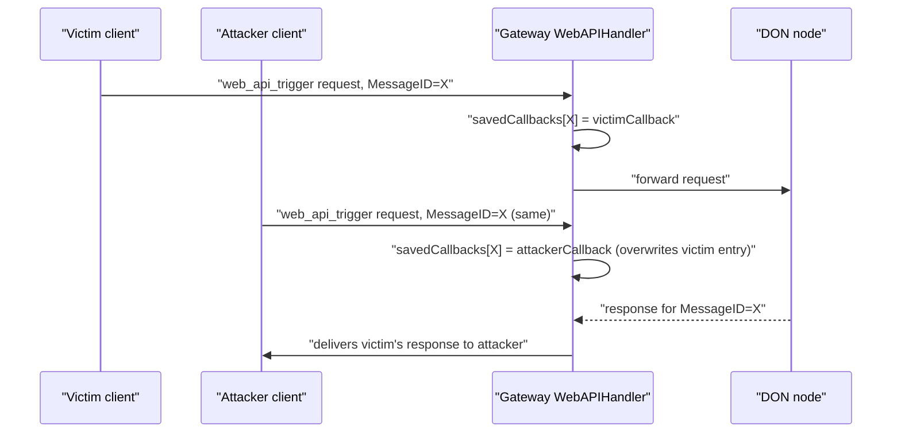

### Title
Cross-user response confusion via attacker-controlled `MessageID` collision in gateway `WebAPIHandler.HandleLegacyUserMessage` - (File: core/services/gateway/handlers/capabilities/handler.go)

### Summary
`WebAPIHandler.HandleLegacyUserMessage` stores each inbound user callback in a shared map keyed solely by the client-supplied `MessageID` field of the signed `api.Message`, with no check for an existing/in-flight entry before overwriting it. Because `MessageID` is attacker-controlled data (up to 128 bytes, only validated for length/format) rather than a value derived from the signer's identity, an unprivileged requester can choose a `MessageID` that collides with another in-flight request and have the DON's response for that ID delivered to their own callback instead of the legitimate requester's.

### Finding Description
`HandleLegacyUserMessage` writes: [1](#0-0) 
into `h.savedCallbacks[msg.Body.MessageID]` unconditionally — no check that the slot is empty, and no binding of the map key to the caller's signer/address. `MessageID` comes straight from the request body and is only checked for length and trailing NUL bytes: [2](#0-1) 
It is fully attacker-chosen; test/tooling code shows it is just an arbitrary string (`"12345"`, or a CLI flag `-id`) that clients pick themselves, not something the gateway generates: [3](#0-2) 

Later, when a node responds, `handleWebAPITriggerMessage` looks up the callback purely by `MessageID`, deletes it, and forwards the raw response to whichever callback is stored there: [4](#0-3) 

The only authentication performed on the *node* side of this path is that `msg.Body.Sender == nodeAddr` (a per-DON node identity check), not any check binding the response back to the original user's identity or session: [5](#0-4) 

Sequence:


Since this is the internet-facing gateway path handling unprivileged client trigger requests (analogous to the report's theme of an unprotected, callback-triggering entry point that an unprivileged party can influence to hijack state meant for someone else), this constitutes a valid analog within the permitted scope (gateway message envelopes/handlers).

### Impact Explanation
An unprivileged party who can send `web_api_trigger` requests to the gateway can, by guessing or observing an in-flight `MessageID`, cause the node's response intended for another user to be delivered to the attacker's own callback (cross-user response confusion / hijack of another requester's trigger result). Depending on payload content, this can leak data intended for the victim, or cause the victim's request to silently receive no response (since it was overwritten and the entry deleted upon the (attacker's) match). This does not require any authentication bypass of the node/DON layer but abuses the trust that `MessageID` uniqueness is respected, which the gateway does not enforce.

### Likelihood Explanation
Likelihood is limited to scenarios where `MessageID` values are guessable/predictable (e.g., sequential counters, fixed/test IDs, or reused values from client libraries) and where the attacker can race the request within the short callback window (default max age ~120s per `defaultCallbackMaxAgeSec`). It requires no special privilege — any client capable of submitting `web_api_trigger` messages to the gateway can attempt this. Real-world exploitability depends on how the specific end-to-end product (e.g., workflow/webhook trigger clients) generates `MessageID`s; if they are randomly generated with sufficient entropy per request, the attack is impractical, but the code contains no server-side enforcement of uniqueness/ownership to prevent it regardless.

### Recommendation
Do not let the map key or the callback delivery decision be solely a client-supplied field. Options:
- Reject the request (instead of silently overwriting) if `MessageID` already has an active entry in `savedCallbacks`, returning an error to the caller.
- Generate/prefix the internal callback map key server-side (e.g., combine `MessageID` with the caller's signer address or a gateway-generated nonce) so responses can only be routed back to the callback that registered that specific composite key.
- Validate that the responding node's message additionally reflects the original sender/receiver binding before dispatching to the saved callback.

### Proof of Concept
1. Victim sends a `web_api_trigger` request through the gateway HTTP/JSON-RPC ingress with `MessageID = "X"`; gateway stores `savedCallbacks["X"] = victimCallback` and forwards to DON nodes.
2. Before the DON responds, attacker sends their own signed `web_api_trigger` request using the same `MessageID = "X"` (a value they freely choose, per `api.Message.Body.MessageID` having no uniqueness/ownership binding — see `Validate()` in `core/services/gateway/api/message.go`).
3. Gateway overwrites `savedCallbacks["X"]` with `attackerCallback` (`core/services/gateway/handlers/capabilities/handler.go:412`).
4. When the DON node responds with `MessageID = "X"`, `handleWebAPITriggerMessage` looks up `savedCallbacks["X"]`, finds the attacker's callback, deletes the entry, and delivers the (potentially victim-destined) response to the attacker (`core/services/gateway/handlers/capabilities/handler.go:148-161`).
5. The victim's original request either receives no response or an unrelated one, while the attacker obtains a response payload that was not addressed to them.

### Citations

**File:** core/services/gateway/handlers/capabilities/handler.go (L148-161)
```go
func (h *handler) handleWebAPITriggerMessage(ctx context.Context, msg *api.Message, nodeAddr string) error {
	h.mu.Lock()
	savedCb, found := h.savedCallbacks[msg.Body.MessageID]
	delete(h.savedCallbacks, msg.Body.MessageID)
	h.mu.Unlock()

	if found {
		// Send first response from a node back to the user, ignore any other ones.
		// TODO: in practice, we should wait for at least 2F+1 nodes to respond and then return an aggregated response
		// back to the user.
		codec := api.JSONRPCCodec{}
		return savedCb.SendResponse(handlers.UserCallbackPayload{RawResponse: codec.EncodeLegacyResponse(msg), ErrorCode: api.NoError})
	}
	return nil
```

**File:** core/services/gateway/handlers/capabilities/handler.go (L248-255)
```go
func (h *handler) HandleNodeMessage(ctx context.Context, resp *jsonrpc.Response[json.RawMessage], nodeAddr string) error {
	msg, err := common.ValidatedMessageFromResp(resp)
	if err != nil {
		return err
	}
	if msg.Body.Sender != nodeAddr {
		return errors.New("message sender mismatch when reading from node ")
	}
```

**File:** core/services/gateway/handlers/capabilities/handler.go (L411-414)
```go
	h.mu.Lock()
	h.savedCallbacks[msg.Body.MessageID] = &savedCallback{id: msg.Body.MessageID, createdAt: time.Now(), Callback: callback}
	don := h.don
	h.mu.Unlock()
```

**File:** core/services/gateway/api/message.go (L61-66)
```go
	if len(m.Body.MessageID) == 0 || len(m.Body.MessageID) > MessageIDMaxLen {
		return errors.New("invalid message ID length")
	}
	if strings.HasSuffix(m.Body.MessageID, NullChar) {
		return errors.New("message ID ending with null bytes")
	}
```

**File:** core/scripts/gateway/web_api_trigger/invoke_trigger.go (L53-57)
```go
func main() {
	gatewayURL := flag.String("gateway_url", "http://localhost:5002", "Gateway URL")
	privateKey := flag.String("private_key", "65456ffb8af4a2b93959256a8e04f6f2fe0943579fb3c9c3350593aabb89023f", "Private key to sign the message with")
	messageID := flag.String("id", "12345", "Request ID")
	methodName := flag.String("method", "web_api_trigger", "Method name")
```
