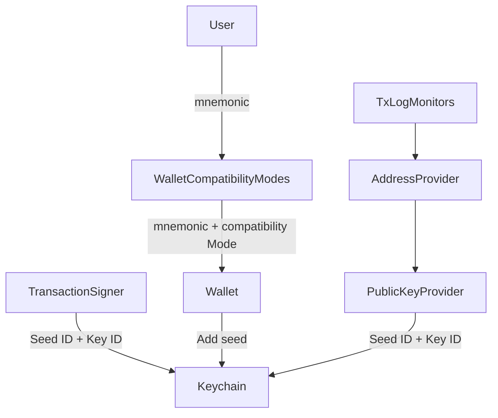

#No Vulnerability found for this question.

**Rationale:** `BioAuth.authenticate` in `features/auth-mobile/module/bio/bio-auth.ios.js` and the underlying `auth.getBioAuthTrigger()` in `features/auth-mobile/module/auth.js` are a device-level app-unlock gate, not a per-seed/per-account signing authorization token. [1](#0-0) 

The `AUTH_KEYSTORE_BIO_AUTH_TRIGGER_KEY` secret is a boolean flag (protected by OS-level `ACCESS_CONTROL_BIOMETRY_CURRENT_SET`) whose only purpose is to force the OS keychain/biometric prompt to run and return `true`/throw, indicating "the device owner passed the local biometric check." [2](#0-1) 

It has no `seedId`/`walletAccount` parameter anywhere in its API, and the README/architecture docs confirm its role is purely to gate UI access to "protectworthy resources" at the app level, unrelated to which wallet account is active: [3](#0-2) 

Actual wallet-account/seed scoping for signing operations happens entirely separately, via `seedId`/`keyId` passed explicitly to `TransactionSigner`/`keychain` (per `docs/development/multi-seed.md`), not through `auth`/`bioAuth`: [4](#0-3) 

Wallet unlock/lock and account switching are managed independently by `wallet.lock()`/`wallet.unlock()` (which add/remove seeds in the keychain) and `activeWalletAccountAtom`, none of which are coupled to `auth.clear()` or bio-auth state: [5](#0-4) [6](#0-5) 

There is therefore no existing invariant that "consent/unlock proofs stay bound to the correct wallet account" for `bioAuth.authenticate()` — this premise misattributes an account-scoping responsibility to a component that was never designed to have one. Replaying a stale `true` resolution from `authenticate()` after a seed switch does not grant access to any different signing context: signing/derivation still requires explicit correct `seedId`/`keyId` arguments supplied by the calling feature, which are not influenced by bio-auth state at all. Thus there is no reachable path by which this stale trigger value causes wrong-account signing, address derivation, or secret disclosure.

### Citations

**File:** features/auth-mobile/module/auth.js (L52-85)
```javascript
  #setBioAuth = async (on, { useDeviceAuth } = {}) => {
    if (!on) {
      await this.#keystore.deleteSecret(this.#key(AUTH_KEYSTORE_DEVICE_AUTH_KEY))
      await this.#keystore.deleteSecret(this.#key(AUTH_KEYSTORE_DEVICE_AUTH_TRIGGER_KEY))
      await this.#keystore.deleteSecret(this.#key(AUTH_KEYSTORE_BIO_AUTH_KEY))
      await this.#keystore.deleteSecret(this.#key(AUTH_KEYSTORE_BIO_AUTH_TRIGGER_KEY))
      return
    }

    const keyOpts = {
      accessible: ACCESSIBLE_WHEN_UNLOCKED_THIS_DEVICE_ONLY,
    }

    if (useDeviceAuth) {
      // Android and iOS handle `ACCESS_CONTROL_USER_PRESENCE` differently when device auth
      // is not enabled. This check ensures consistent behavior across platforms.
      const canAuth = await this.canUseDeviceAuth()
      if (!canAuth) {
        throw new DeviceAuthenticationUnavailableError()
      }

      await this.#keystore.setSecret(this.#key(AUTH_KEYSTORE_DEVICE_AUTH_KEY), on, keyOpts)
      await this.#keystore.setSecret(this.#key(AUTH_KEYSTORE_DEVICE_AUTH_TRIGGER_KEY), on, {
        ...keyOpts,
        accessControl: ACCESS_CONTROL_USER_PRESENCE, // This flag allows iOS to fallback to device pin.
      })
    } else {
      await this.#keystore.setSecret(this.#key(AUTH_KEYSTORE_BIO_AUTH_KEY), on, keyOpts)
      await this.#keystore.setSecret(this.#key(AUTH_KEYSTORE_BIO_AUTH_TRIGGER_KEY), on, {
        ...keyOpts,
        accessControl: ACCESS_CONTROL_BIOMETRY_CURRENT_SET,
      })
    }
  }
```

**File:** features/auth-mobile/module/auth.js (L151-158)
```javascript
  getBioAuthTrigger = async () => {
    const isAuthenticated = await this.#keystore.getSecret(
      this.#key(AUTH_KEYSTORE_DEVICE_AUTH_TRIGGER_KEY)
    )
    if (isAuthenticated) return isAuthenticated

    return this.#keystore.getSecret(this.#key(AUTH_KEYSTORE_BIO_AUTH_TRIGGER_KEY))
  }
```

**File:** features/auth-mobile/README.md (L29-36)
```markdown
If you're building a feature that requires access to authentication details, you can depend on `authAtom` and observe changes:

```js
authAtom.observe(({ hasBioAuth, biometry, hasPin, shouldAuthentiate }) => {
  // shouldAuthenticate is true if either a pin was set or bio auth enabled
  // (inidicator for the UI to restrict access to protectworthy resources such as the mnemonic phrase)
  // biometry is available biometry variant
})
```

**File:** docs/development/multi-seed.md (L7-17)
```markdown

```

**File:** features/wallet/module/wallet.js (L274-298)
```javascript
  isLocked = async () => this.#isLocked

  lock = async () => {
    this.#keychain.removeAllSeeds()

    this.#isLocked = true
  }

  unlock = async ({ passphrase } = {}) => {
    try {
      const { seed } = await this.#getSeed({ passphrase })
      const primarySeedId = await this.#keychain.addSeed(seed)
      this.#primarySeedIdAtom.set(primarySeedId)

      const extraSeeds = await this.#getExtraSeeds()
      await Promise.all(extraSeeds.map(({ seed }) => this.#keychain.addSeed(seed)))

      this.#isLocked = false

      return { primarySeedId }
    } catch (err) {
      this.#logger.debug('unlock() failed: wrong password', err)
      throw new Error('Wrong password. Try again.')
    }
  }
```

**File:** features/wallet-accounts/src/plugins/lifecycle.ts (L127-129)
```typescript
  const onClear = async () => {
    await Promise.all([walletAccounts.clear(), activeWalletAccountAtom.set(undefined)])
  }
```
