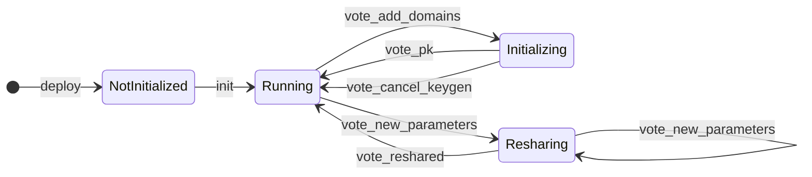

### Title
Unprotected Two-Step Contract Initialization Allows Attacker to Seize MPC Participant Set - (File: `crates/contract/src/lib.rs`)

### Summary

The MPC contract deployment follows a two-transaction pattern: first deploy (`without-init-call`), then call `init` in a separate transaction. The `init` function lacks caller access control, meaning any account can race to call it before the legitimate operator and install a malicious participant set, gaining full control over threshold signing.

### Finding Description

The deployment procedure is explicitly documented and scripted as two separate transactions:

**Step 1 — Deploy (no init call):** [1](#0-0) 

```shell
near contract deploy mpc-contract.test.near use-file "$MPC_CONTRACT_PATH" without-init-call ...
```

**Step 2 — Initialize (separate transaction):** [2](#0-1) 

```shell
near contract call-function as-transaction mpc-contract.test.near init file-args /tmp/init_args.json ...
```

The same two-step pattern is used in the automated deployment script: [3](#0-2) 

Between these two transactions, the contract is in `NotInitialized` state and `init` is callable by anyone. The `init_running` function is correctly protected with `#[private]`: [4](#0-3) 

However, the primary `init` function — the one used in all production deployment flows — does not carry `#[private]` or any equivalent caller restriction. The README confirms this implicitly: "The owner will need to initialize it via `init`" is a convention, not an enforcement: [5](#0-4) 

The state machine confirms the unguarded transition: [6](#0-5) 

```
[*] --> NotInitialized : deploy
NotInitialized --> Running : init   ← no caller restriction
```

Notably, the test suite has an explicit test verifying that `init_running` rejects external callers — but no equivalent test exists for `init`: [7](#0-6) 

### Impact Explanation

An attacker who calls `init` first can supply an arbitrary `ThresholdParameters` — for example, a single-participant set where the attacker controls the only participant account. This gives the attacker:

- Full control over `vote_add_domains`, `vote_new_parameters`, and all governance functions.
- The ability to drive the contract into `Initializing` state and supply a fraudulent public key via `vote_pk`, establishing an attacker-controlled MPC key.
- The ability to respond to all `sign()` requests with attacker-generated signatures, or to block all signing entirely.

This constitutes **unauthorized threshold signature issuance** — matching the Critical impact tier: *"Unauthorized transaction execution, threshold signature issuance, or confidential key derivation output without the required participant authorization."*

### Likelihood Explanation

**Medium.** NEAR does not have an EVM-style public mempool, but the attack window is not a mempool race — it is a block-level race. The attacker only needs to monitor the chain for a newly deployed contract in `NotInitialized` state and submit an `init` call in any subsequent block before the legitimate operator does. Deployment events are observable on-chain. The automated deployment script introduces a measurable delay between `near_contract` phase and `near_init` phase: [3](#0-2) 

This delay (key collection, argument generation, etc.) spans multiple blocks, giving an attacker ample time to act.

### Recommendation

Add `#[private]` to the `init` function so that only the contract account itself can call it (matching the protection already applied to `init_running`). Alternatively, combine the deploy and init into a single atomic transaction using NEAR's `--init-function` / `--init-args` flags, eliminating the uninitialized window entirely.

### Proof of Concept

1. Operator deploys contract: `near contract deploy mpc-contract.test.near use-file ... without-init-call ...`
2. Attacker observes the new `NotInitialized` contract on-chain.
3. Attacker calls `init` with `parameters = { threshold: 1, participants: [attacker_account] }`.
4. Contract transitions to `Running` with attacker as sole participant.
5. Operator's subsequent `init` call fails ("already initialized").
6. Attacker calls `vote_add_domains` to add a signing domain, then drives DKG to completion with a key they control.
7. All future `sign()` requests are answered by the attacker's node with attacker-controlled signatures — or withheld entirely.

### Citations

**File:** docs/localnet/localnet.md (L131-131)
```markdown
near contract deploy mpc-contract.test.near use-file "$MPC_CONTRACT_PATH" without-init-call network-config mpc-localnet sign-with-keychain send
```

**File:** docs/localnet/localnet.md (L268-268)
```markdown
near contract call-function as-transaction mpc-contract.test.near init file-args /tmp/init_args.json prepaid-gas '300.0 Tgas' attached-deposit '0 NEAR' sign-as mpc-contract.test.near network-config mpc-localnet sign-with-keychain send
```

**File:** localnet/tee/scripts/rust-launcher/deploy-tee-cluster.sh (L1669-1703)
```shellscript
  if should_run_from_start near_contract; then
    pause_phase "NEAR: build + deploy MPC contract"
    build_contract
    deploy_contract
    maybe_stop_after_phase near_contract
  fi

  if should_run_from_start deploy; then
    pause_phase "Deploy CVMs (dstack)"
    deploy_nodes_range "$NODE_RANGE_START" "$NODE_RANGE_END"
    maybe_stop_after_phase deploy
  fi

  if should_run_from_start collect; then
    pause_phase "Collect node keys from /public_data"
    collect_keys
    maybe_stop_after_phase collect
  fi

  if should_run_from_start init_args; then
    pause_phase "Generate init_args.json"
    generate_init_args "$threshold"
    maybe_stop_after_phase init_args
  fi

  if should_run_from_start near_keys; then
    pause_phase "NEAR: add signer+responder keys to node accounts"
    add_node_keys_from_keysjson
    maybe_stop_after_phase near_keys
  fi

  if should_run_from_start near_init; then
    pause_phase "NEAR: init contract"
    init_contract
    maybe_stop_after_phase near_init
```

**File:** crates/contract/src/lib.rs (L1975-1979)
```rust
    // This function can be used to transfer the MPC network to a new contract.
    #[private]
    #[init]
    #[handle_result]
    pub fn init_running(
```

**File:** crates/contract/README.md (L233-237)
```markdown
### Deployment

After deploying the contract, it will first be in an uninitialized state. The owner will need to initialize it via `init`, providing the set of participants and threshold parameters.

The contract will then switch to running state, where further operations (like initializing keys, or changing the participant set), can be taken.
```

**File:** crates/contract/README.md (L243-254)
```markdown

```

**File:** crates/contract/tests/sandbox/upgrade_to_current_contract.rs (L437-474)
```rust
#[tokio::test]
async fn init_running_rejects_external_callers_pre_initialization() {
    let (worker, contract) = init().await;
    let number_of_participants = 2;
    let (accounts, participants) = gen_accounts(&worker, number_of_participants).await;

    let threshold_parameters = ThresholdParameters::new(
        participants.clone(),
        Threshold::new(number_of_participants as u64),
    )
    .unwrap();

    let init_running_args = serde_json::json!({
            "domains": [],
            "next_domain_id": 0,
            "keyset": Keyset::new(EpochId::new(2), vec![]),
            "parameters": threshold_parameters,
    });

    let execution_error = accounts[0]
        .call(contract.id(), method_names::INIT_RUNNING)
        .max_gas()
        .args_json(init_running_args)
        .transact()
        .await
        .unwrap()
        .into_result()
        .expect_err("method is private and not callable from participant account.");

    let error_message = format!("{:?}", execution_error);

    let expected_error_message = "Smart contract panicked: Method init_running is private";

    assert!(
        error_message.contains(expected_error_message),
        "init_running call was accepted by external caller. expected method to be private. {:?}",
        error_message
    )
```
